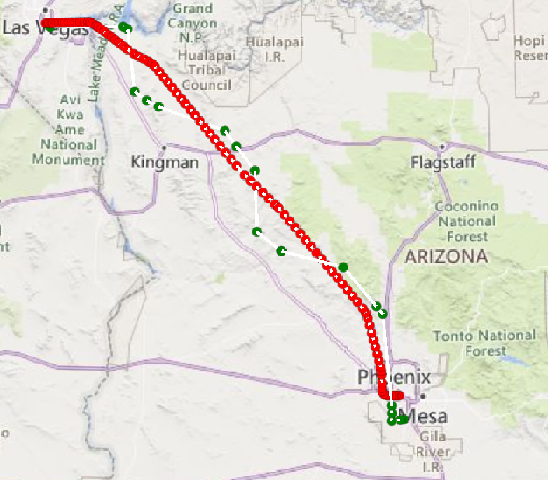

## Results of 02/26/2024 23:28 UTC PHX>LAS Comparison (Green is Simbrief, Red is FlightAware):

The coordinates of the starting areas don't match up with their airports. One area our team can improve upon for our flight-planning system is ensuring that our starting coordinates are definitely from the airports they are taking off from. 

## Results of 02/27/2024 16:10 UTC PHX>LAS Comparison (Green is Simbrief, Red is FlightAware):

The same issue as above is witnessed in this picture. The coordinates do not start from PHX Sky Harbor airport as they should. They also do not end up at KLAS and instead end slightly south of the airport. The coordinates on the flight log are not accurate to the ones of the actual airports. 

## Results of 02/27/2024 19:42 UTC PHX>LAS Comparison (Green is Simbrief, Red is FlightAware):

You can see that the same issue as above is observed where the start and end coordinates do not line up with the airports.

I looked further into this issue to check if all of the coordinates were possibly displaced by the same amount (causing everything to be shifted south), but the differences between the actual airport coordinates and Simbrief's airport coordinates do not make any sense:

Actual PHX Latitude Cooordinate - Simbrief PHX Latitude Coordinate = 33.4342N - 33.261N = 0.1732N

Actual PHX Longitude Coordinate - Simbrief PHX Longitude Coordinate = 112.0083W - 12.007W = 0.0013W

Actual LAS Latitude Cooordinate - Simbrief LAS Latitude Coordinate = 36.0840N - 36.0480N = 0.036N

Actual LAS Longitude Coordinate - Simbrief LAS Longitude Coordinate = 115.1522W - 115.091W = 0.0612W

As you can see, the differences between the different coordinates aren't very close, so it is unclear why the coordinates are incorrect on Simbrief. 

## File naming conventions and other information

"SB_PHX_LAS_022624_2328.pdf" means:
- SB = it was generated in simbrief. An absence of "SB" indicates flightaware data.
- PHX_LAS = it's a flight from phx to las
- 022624 = february 26th 2024. This is the date of the take off. 
- 2328 = 23:28 UTC/Zulu Time. This is the take off time. 

The latitude, longitude, and altitude are gathered from the flight log page on the SB-generated flight plan from the LAT LONG and FL (flight level) metrics. FL is measured in 100s of feet (so 280 FL indicates 28000 feet, 034 indicates 3400 feet).

MAKE SURE you divide the latitude and longitude by 100. Also, W/S are negative, N/E are positive coordinates.

